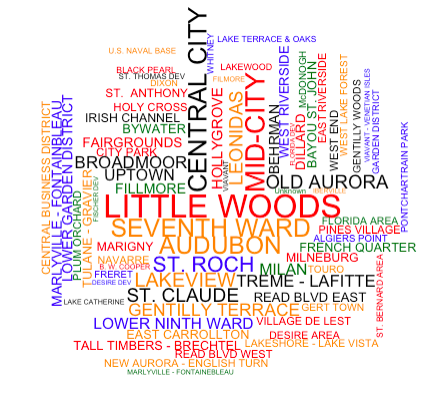

## 1. Problem understanding

Nowadays, many cities in the US have taken the advantages of the 311 hotline in order to deliver a better city services for the community and also collect more data for analysis in running local government. Unlike 911 hotline which is mainly for emergency calls, this 311 is for non-emergency ones. It covers a wide range of problems that may happen in the city from issues with roads, lights, trees, parks to trash. Because of its advantages, 311 hotline is increasing its popularity throughout the country which has resulted into high number of calls for issues everyday.

In this report we are going to analyze the 311 calls data from the city of New Orleans in Louisiana state in the US. The data is obtained from the data website from the city of New Orleans from 2012 till present. However, due to large amount of data at more than 250K rows, which is heavy for computation, we are going to use data for the year 2016 and 2017 only. We will do some analysis first then start to build a machine learning model to predict the number of daily calls for specific type of issues.

Details about the data resources will be provided in the References section of the report.

## 2. Data Understanding

There are 16 columns in our dataset. Here the columns speak for themselves.

| Column Name | Type |
|:-----|:------:|
| ticket_id  | Plain Text   |     
| issue_type  | Plain Text   |     
| ticket_created_date_time  | Date & Time   |     
| ticket_closed_date_time  | Date & Time   |     
| ticket_status  | Plain Text   |     
| issue_description  | Plain Text   |     
| street_address  | Plain Text   |     |
| neighborhood_district  | Plain Text   |   
| council_district  | Plain Text   |     
| city  | Plain Text   |     
| state  | Plain Text   |     
| zip_code  | Number   |     
| location  | Location   |     
| geom  | Location   |     
| latitude  | Number   |     
| longitude  | Number   |

Before doing analysis, let's first load some required packages as below:
```
# Data Visualization
library('ggplot2')
library('leaflet')
library('grid')
library('plotly')
library('wordcloud')
library('corrplot')
# Data manipulation & wrangling
library('dplyr')
library('readr')
library('lubridate')
library('tibble')
library('data.table')
# Macchine learning library
library('randomForest')
library('e1071')
library("caret")
library("gbm")
library("Metrics") # handy evaluation functions
```
## 3. Data Preparation

### Load data
The data will be downloaded directly from the NOLA.org data website.
We will use package tibble to increase the data loading due to the number of data in the CSV file.

```{r message=FALSE, warning=FALSE}
# Later divide original dataset file into 70:30 for training and testing purposes
calls_16_17 <- as.tibble(fread('311_Calls__2012-Present_.csv'))
```

For a dataset like this, there will be chances that some rows are duplicated. Hence, we have to remove them first.
For the datetime data, we will convert them into datetime format using the package lubridate. Original columns will be removed.

Coulumns Geom (the location, left empty), Location (combination of Longitude and Latitude), State (all of them are in the same state of Louisiana), and City (all of them are in New Orleans) will be removed from dataset.

```{r message = FALSE, warning = FALSE}
calls_16_17 <- subset(calls_16_17, !duplicated(calls_16_17$ticket_id))
calls_16_17$formated_created_date = lubridate::mdy_hms(calls_16_17$ticket_created_date_time)
calls_16_17$formated_closed_date = lubridate::mdy_hms(calls_16_17$ticket_closed_date_time)
calls_16_17$date = as.Date(as.POSIXct(calls_16_17$formated_created_date))
calls_16_17$ticket_created_date_time = NULL
calls_16_17$ticket_closed_date_time  = NULL
calls_16_17$geom = NULL
calls_16_17$location = NULL
calls_16_17$state = NULL
calls_16_17$city = NULL
```

Let's create new dataset from the current dataset with only data for the year 2017 and 2016.

```{r message = FALSE, warning = FALSE}
calls_16_17 <- calls_16_17 %>% mutate(year = lubridate::year(date))
calls_16_17 <- calls_16_17 %>% filter(year %in% c('2016', '2017'))
```


### Summary of data

```{r message=FALSE}
summary(calls_16_17)
str(calls_16_17)
```


### Types of requests

As there are about 33 issues types in the dataset for 2 years, to make it simple, we will group them into different categories based on the category provided in the website of New Orleans for 311 calls (https://nola.gov/311/service-request-types/).

| ID | Name |
|:-----|:------:| 
|1 |	Abandoned Vehicle Reporting/Removal |
|2 |	Catch Basin Maintenance |
|3 |	Code Enforcement General Request |
|4 |	Curb Repair |
|5 |	Dead Animal Pickup |
|6 |	General Service Request|
|7 |	Grass Service|
|8 |	Illegal Dumping Reporting|
|9 |	Large Item Trash/Garbage Pickup|
|10	| Manhole Cover Maintenance|
|11	| Mosquito Control|
|12	| Non Rodent Complaint|
|13	| NORDC Grass Service|
|14	| NORDC Park Complaint|
|15	| NORDC Park Maintenance|
|16	| Occupancy Inspection|
|17	| Park Maintenance|
|18	| Pothole/Roadway Surface Repair|
|19	| Residential Recycling Programs|
|20	| Road Shoulder Repair|
|21	| Road Surface Marking|
|22	| Rodent Complaint|
|23	| Sidewalk Repair|
|24	| Street Flooding/Drainage|
|25	| Street Light|
|26	| Street Name Sign|
|27	| Subsidence|
|28	| Traffic Sign|
|29	| Traffic Signal|
|30	| Trash/Garbage Pickup|
|31	| Tree Maintenance|
|32	| Tree Service|
|33	|Tree Service Emergency|


``` {r echo=FALSE,  warning=FALSE, message=FALSE}
calls_16_17 %>% group_by(issue_type) %>% count()
```

Because there are more than 30 types of requests, it will be hard for us to see it clearly in graph. Let's try to group them into categories of issues. This is based on the category provided in the 311 website of New Orleans.

9 super categories:

  | ID | Name |
  |:-----|:------:|  
  |1 | Abandoned Vehicles	|			
  |2 | Lights/Signs/Signals	|			
  |3 | Mosquito, Termite & Rodent Control		|	
  |4 | NORDC	|			
  |5 | Parks & Parkways	|			
  |6 | Property Maintenance	|			
  |7 | Roads/Drainage	|			
  |8 | Trash/Recycling|
  |9 | Other|

```{r warning=FALSE, message=FALSE}
road_drainage = c("Catch Basin Maintenance","Curb Repair", "Manhole Cover Maintenance", "Pothole/Roadway Surface Repair", "Road Shoulder Repair", "Road Surface Marking", "Sidewalk Repair", "Street Flooding/Drainage", "Subsidence")
lights_signs_signals = c("Street Light","Street Name Sign", "Traffic Sign", "Traffic Signal")
property_maintenance = c("Code Enforcement General Request","Property Maintenance")
trash_recycling = c("Dead Animal Pickup","Illegal Dumping Reporting", "Large Item Trash/Garbage Pickup", "Residential Recycling Programs", "Trash/Garbage Pickup")
abandoned_vehicles = c("Abandoned Vehicle Reporting/Removal","")
parks_parkways = c("Grass Service","Park Maintenance", "Tree Service", "Tree Service Emergency", "Tree Maintenance")
mosquitos_termite_rodent_control = c("Mosquito Control", "Rodent Complaint", "Non Rodent Complaint")
nordc= c("NORDC Grass Service","NORDC Park Complaint", "NORDC Park Maintenance")
other = c("General Service Request", "Occupancy Inspection")

calls_16_17$issue_category = calls_16_17$issue_type
calls_16_17$issue_category <- ifelse(calls_16_17$issue_category %in% road_drainage, "Roads/Drainage", calls_16_17$issue_category)
calls_16_17$issue_category <- ifelse(calls_16_17$issue_category %in% lights_signs_signals, "Lights/Signs/Signals", calls_16_17$issue_category)
calls_16_17$issue_category <- ifelse(calls_16_17$issue_category %in% property_maintenance, "Property Maintenance", calls_16_17$issue_category)
calls_16_17$issue_category <- ifelse(calls_16_17$issue_category %in% trash_recycling, "Trash/Recycling", calls_16_17$issue_category)
calls_16_17$issue_category <- ifelse(calls_16_17$issue_category %in% abandoned_vehicles, "Abandoned Vehicles", calls_16_17$issue_category)
calls_16_17$issue_category <- ifelse(calls_16_17$issue_category %in% parks_parkways, "Parks & Parkways", calls_16_17$issue_category)
calls_16_17$issue_category <- ifelse(calls_16_17$issue_category %in% mosquitos_termite_rodent_control, "Mosquito, Termite & Rodent Control", calls_16_17$issue_category)
calls_16_17$issue_category <- ifelse(calls_16_17$issue_category %in% nordc, "NORDC", calls_16_17$issue_category)
calls_16_17$issue_category <- ifelse(calls_16_17$issue_category %in% other, "Other", calls_16_17$issue_category)

rm(road_drainage, lights_signs_signals, property_maintenance, trash_recycling, abandoned_vehicles, parks_parkways, mosquitos_termite_rodent_control, nordc, other)

calls_16_17$trans_category = calls_16_17$issue_category

cate = c("Abandoned Vehicles", "Lights/Signs/Signals", "Mosquito, Termite & Rodent Control", "NORDC", "Parks & Parkways", "Property Maintenance", "Roads/Drainage", "Trash/Recycling", "Other")

```

Finally, let's transform the values of 2 columns category and issue_Type into numeric values which will be used for model building later (trans_category and trans_type). The numeric values for each type will be corresponding to the ID above.

```{r echo=FALSE, warning=FALSE, message=FALSE}
x <- 1
for (i in cate){
  calls_16_17$trans_category <- ifelse(calls_16_17$trans_category %in% cate[x], x, calls_16_17$trans_category)
  x = x+1
}

calls_16_17$trans_type = calls_16_17$issue_type

type = c("Abandoned Vehicle Reporting/Removal", "Catch Basin Maintenance", "Code Enforcement General Request", "Curb Repair", "Dead Animal Pickup", "General Service Request", "Grass Service", "Illegal Dumping Reporting", "Large Item Trash/Garbage Pickup", "Manhole Cover Maintenance", "Mosquito Control", "Non Rodent Complaint", "NORDC Grass Service", "NORDC Park Complaint", "NORDC Park Maintenance", "Occupancy Inspection", "Park Maintenance", "Pothole/Roadway Surface Repair", "Residential Recycling Programs", "Road Shoulder Repair", "Road Surface Marking", "Rodent Complaint", "Sidewalk Repair", "Street Flooding/Drainage", "Street Light", "Street Name Sign", "Subsidence", "Traffic Sign", "Traffic Signal", "Trash/Garbage Pickup", "Tree Maintenance", "Tree Service", "Tree Service Emergency")
y <- 1
for (j in type){
  calls_16_17$trans_type <- ifelse(calls_16_17$trans_type %in% type[y], y, calls_16_17$trans_type)
  y = y+1
}

rm(x, y, type)
```


``` {r echo=FALSE, warning=FALSE, message=FALSE}
calls_16_17 %>% group_by(issue_category) %>% count()

```

#### Get dataset for 2016

Data for the year 2016 will be used for visualization, to understand more about the data.

```{r warning = FALSE, echo = FALSE, message=FALSE}
calls_16 <- calls_16_17 %>% filter(year == '2016')
```


## 4. Data Visualizations

Note: Most of the charts in this section are interactive, please hover the mouse over the dot to get exact number of calls, click on the legend to disable/enable item(s).


### Density of the requests

Plotting data into the map to have clearer view where the requests most likely to happen. To reduce the loading for computer, here we will only use 5,000 samples from the total of more 47,000 rows.
Here we can easily see that most of the requests are in the central of New Orleans city, with some calls made in the area of Venetians Isles.


```{r warning = FALSE, echo = FALSE, message=FALSE}

set.seed(1234)
smpl <- sample_n(calls_16, 5000)

m <- leaflet(data = smpl) %>% setView(lng = -90.000534, lat = 29.971909, zoom = 12)
m %>% addTiles() %>%  addCircleMarkers(~ longitude, ~ latitude, radius = 1,
                   color = "green", fillOpacity = 0.7)

```


### Total number of requests by issues category

It's obvious in the plot below that Trash/Recycling type has outnumbered the others with more than 17,500 calls in 2016. Property maintenance is at the second position with nearly 7,000 calls, followed closedly by Roads/Drainage, Abandoned Vehicles and Lights/Signs/Signals at about 6,000, 5,800 and 5,200 calls respectively. NORDC is the least popular in this chart.

```{r echo=FALSE, warning=FALSE, message=FALSE}

calls_16 %>%
group_by(issue_category) %>% count() %>%
ggplot(aes(reorder(issue_category, -n), n, fill = issue_category)) +
geom_col() +
scale_y_sqrt() +
theme(legend.position = "none")+
labs(y = "Total number of calls", x = "Issue Category") +
coord_flip()

```


### Day of the week of occured requests

Most of the calls received are usually on the weekdays with very high numbers again in Trash/Recycling and the least numbers in NORDC category which is compartible with our numbers in the chart above. Poeple tend to request less calls during weekends.

```{r echo=FALSE,warning=FALSE, message=FALSE}
p <- calls_16 %>%
mutate(wday = lubridate::wday(formated_created_date, label=TRUE)) %>%
group_by(wday, issue_category) %>%
count() %>%
ggplot(aes(wday, n, colour = issue_category)) +
geom_point(size = 4) +
labs(x = "Day of the week", y = "Total number of calls") +
theme(legend.position = "right")
ggplotly(p)
```


### Month of the year of occured calls

August has dominated others months in the number of calls through out the year and surprisingly the number of calls on happened on Monday (1,671 calls) is the highest among other days. Unfortunately, number for Saturday and Sunday are too small to be seen clearly in this chart.


```{r echo=FALSE,  warning=FALSE, message=FALSE}
calls_16 %>%
mutate(month = factor(lubridate::month(formated_created_date, label = TRUE)),
weekday = factor(lubridate::wday(formated_created_date, label = TRUE))) %>%
group_by(month, weekday) %>%
count() %>%
plot_ly(x = ~month, y = ~n, color = ~weekday)
```


### Hour of the day of occured requests

A first glance at the line graph, we can easily notice that 12 months share almost the same patterns in the number of calls, despite some small fluctuations in January, May, November.
The earliest calls are often made during 7 in the morning and the latest ones are around 5-6PM. Peaking time for calls is around 9AM which is predictable as this is for service calls. However, the trend tends to decrease rapidly after 9AM to 12 noon with around 670 calls (in August). The second highest point is at around 2PM for most of the months and dropped dramatically after that, reaching its lowest point after 5PM.


```{r echo=FALSE, warning = FALSE, message=FALSE}
p <- calls_16 %>%
mutate(hr = lubridate::hour(formated_created_date),
month = factor(lubridate::month(formated_created_date, label = TRUE))) %>%
group_by(hr, month) %>%
count() %>%
ggplot(aes(hr, n, color = month)) +
geom_line(size = 1) +
labs(x = "Hour of the day", y = "Number of calls")
ggplotly(p)
```


### Popular neighborhood districts with calls

Here we want to find out which neighborhood districts have the most number of calls for 311 service. In the dataset, this column contains some NA values because many calls (2,303 calls) under category "General Service Request" which are usually calls for details, not for logging new ticket for issues. We will simply ignore them as we can't identify which districts they are calling from. These rows can be removed from our dataset but here we decide to keep them as we will need them to build our predict model which will be discussed later in the Modelling section.

```{r echo=FALSE, warning = FALSE, message=FALSE}

calls_16 %>% group_by(issue_type, neighborhood_district, issue_description) %>% filter(issue_type == "General Service Request") %>% count
district = data.frame(table(select(calls_16, neighborhood_district) %>% filter(neighborhood_district != "")))
colnames(district)=c('Name', 'Freq')
district$Name = as.character(district$Name)

wordcloud(district$Name, district$Freq, min.freq = 1, random.order=F, max.words=200, rot.per=0.35, scale=c(2,.4),
random.color=T, colors=c('black', 'red','dark green','dark orange', 'blue'))

```



### Number of open and closed ticket

A large number of requests are closed. It makes sense for issues related to Roads/Drainage to remain open as this might take more time to complete than the Trash/Recycling. This feature along with the closed date feature will be useful if we want to build a model to predict processing time for a specific request.

```{r echo=FALSE, warning=FALSE, message=FALSE}
p <- calls_16 %>%
group_by(ticket_status, issue_category) %>% count() %>%
ggplot(aes(ticket_status, n, fill = issue_category)) +
geom_bar(stat = "identity", position = "dodge") +
theme(legend.position = "right")+
labs(y = "Total number of requests", x = "Status of request")
ggplotly(p)

```


### Working with external dataset

As a common practice, external sources are usually used in combination with this type of dataset in building predicting model. Here we will use US Calendar specifically for Louisiana state - home of New Orleans city and also the weather data from National Weather Service Forecast Office which is collected manually from the website. However, due to the needs for our model, we only keeps some useful features in this data such as the date, average temperature, precipitation and snowfall. The city is located in Mississippi River Delta with humid subtropical weather which means it will have short, generally mild winters (little snowfall) and hot, humid summers. That's also one of the key points for us in considering whether those weather factors will have affects on the number of request calls in the city. Later we will do some analysis with this new information to check if it's true that the temperature will have more impact than the snowfall factor.

First, we will replace the "T" values in the precipitation column into a very small value "0.01". "T" stands for "Trace", some precipitation fell but not enough to measure. Some of the values in the snowfall column are NAs, we will replace these with the mean values of the snowfall. However, this will be applied only for the months of January, February and December as these are the time for high chances of snowfall. For other months, we will replace NAs with 0 as it doesn't make sense for snow to fall in autumn season.

Later we will join this dataset into our main dataset by "date" column.

```{r warning=FALSE, message=TRUE}
# Weather data for New Orleans: http://w2.weather.gov/climate/index.php?wfo=LIX
weather <- as.tibble(fread('Weather_NewOrleans_LA_16_17.csv'))
weather$date = mdy(weather$date)
weather$precipitation = as.numeric(ifelse(weather$precipitation == "T", "0.01", weather$precipitation))
mean_snow <- as.numeric(weather %>% mutate(mth = lubridate::month(date)) %>%
                          dplyr::summarize(Mean = mean(snowfall, na.rm=TRUE)))

weather$snowfall = ifelse(lubridate::month(weather$date) != 12 & lubridate::month(weather$date) != 1 & lubridate::month(weather$date) != 2 
                          & is.na(weather$snowfall), 0, weather$snowfall)
weather$snowfall = ifelse(is.na(weather$snowfall), mean_snow, weather$snowfall)

w <- weather %>% select(date, precipitation, average_temp, snowfall)
calls_16_17 <- left_join(calls_16_17, w, by = "date")

rm(w, mean_snow)
summary(weather)

```

Data about the US Holiday will also be included into our dataset. We only used data for the year 2017 and 2016. Column Holiday is added into current dataset, this will take values 0 (not holiday) and 1 (holiday).


``` {r echo=FALSE, warning=FALSE, message=TRUE}
# Ref: https://www.officeholidays.com/countries/usa/regional.php?list_year=2018&list_region=Louisiana

calls_16_17$holiday = 0
holiday = as.Date(c("2017-01-01", "2017-01-15", "2017-02-13", "2017-03-30", "2017-05-28", "2017-07-04", "2017-09-04", "2017-11-06", "2017-11-12", "2017-11-22", "2017-12-25", "2016-01-01", "2016-01-15", "2016-02-13", "2016-03-30", "2016-05-28", "2016-07-04", "2016-09-05", "2016-11-06", "2016-11-12", "2016-11-22", "2016-12-25"))
calls_16_17$holiday <- factor(ifelse(calls_16_17$date %in% as.Date(holiday), 1, calls_16_17$holiday))
calls_16 <- calls_16_17 %>% filter(year == '2016')
```


### Impacts of weather on our number of calls

Now, let's do plotting to see if our guess in the previous section about the affects of weather data is true or not. Below is the chart of the Average Temperature. As known before, August has the largest number of calls request through out the year, here we can see that the tempereture also peaks in the month from July to September. We are not 100% sure this will have great impact or not but it's better to keep that in mind when selecting feature lists in building our models. 

```{r echo=FALSE,  warning=FALSE, message=FALSE}
p1 <- calls_16 %>%
  group_by(date) %>%
  summarise(average_temp = mean(average_temp)) %>%
  ggplot(aes(date, average_temp)) +
  geom_line(color = "blue", size = 1) +
  labs(x = "", y = "Average Temp")
ggplotly(p1)

```


Here the trend is clearer for the statistics of Average Precipitation, the highest values are in the month of August till early September.

```{r echo=FALSE,  warning=FALSE, message=FALSE}
p2 <- calls_16 %>%
  group_by(date) %>%
  summarise(precipitation = mean(precipitation)) %>%
  ggplot(aes(date, precipitation)) +
  geom_line(color = "blue", size = 1) +
  labs(x = "", y = "Average Precipitation")
ggplotly(p2)

```


For snowfall, because of the geographic location of New Orleans, it's less likely to have snow in this city and the number is true here. It snowed more in February and December. However, it comes with a very low number at around 0.0049. This shows that the depth of snow will be insignificant compared to other cities in the US such as NYC or Cleveland

```{r echo=FALSE, warning=FALSE, message=FALSE}
p3 <- calls_16 %>%
group_by(date) %>%
summarise(snowfall = mean(snowfall)) %>%
ggplot(aes(date, snowfall)) +
geom_line(color = "blue", size = 1) +
labs(x = "", y = "Average Snowfall")
ggplotly(p3)

```


Finally, our new dataset will be splitted into 70:30 ratio for train and test set.

```{r echo=FALSE, warning=FALSE, message=FALSE}

data <- calls_16_17 %>% mutate(trans_type = factor(trans_type), trans_category = factor(trans_category), holiday = factor(holiday), weekday = factor(lubridate::wday(date)), month = factor(lubridate::month(date)), year = factor(year)) %>% group_by(trans_type, trans_category, weekday, month, year, holiday, average_temp, precipitation, snowfall) %>% count()

data <- data.table(data)
#data[,logN:=log1p(n)]

set.seed(1234)
indexes = sample(1:nrow(data), size=0.3*nrow(data))
train <- data[-indexes,]
test <- data[indexes,]

```

## 5. Modeling

Our goal is to build a model for predicting the total volumne of daily call requests for specific issue type received through the 311 phone line. In order to do this we have to prepare data for both training and testing purposes. A new dataset is created from the original dataset which contains required columns for our model are: trans_type, trans_category, weekday, month, year, holiday, average_temp, precipitation, snowfall, n (this is our response).

Models will be build using several algorithms such as Random Forest, GBM and SVM.


### Random Forest Model

```{r echo=FALSE, warning=FALSE, message=FALSE}
model.rf <- randomForest(n ~ ., data = train, class = "rf")
print(model.rf)
plot(model.rf)
# Plot importance of features
varImpPlot(model.rf, sort = T, main="Variable Importance", n.var=9)
# Check RMSE
rmse(predict(model.rf, test), test$n) # 6.32604
# Tunning model
model.rf1 <- train(n ~ ., data = train,
                     ntree = 600,
                     method = "rf",
                     trControl = trainControl(method = "none"), importance = TRUE,
                     tunelength = 10, metric = "rmse")
# Check RMSE
rmse(predict(model.rf, test), test$n) # 6.32604
rmse(predict(model.rf1, test), test$n) # 6.718642
```

After printing out the importance of the variables, we can see that only transaction type and category contribute most to the importance. Temperature also has importance as our predictioc before but not much, the same is true for month and weekday. The least importance factor is snowfall.


### Gradient Boosting Machine (GBM)

```{r echo=FALSE, warning=FALSE, message=FALSE}
# GBM model with random parameters
model.gbm <- gbm(n ~ ., data=train, distribution="gaussian", n.trees = 1000, interaction.depth=5,
           n.minobsinnode=8, shrinkage=0.01, bag.fraction=0.75)
prdt <- predict(model.gbm, test, n.trees = 1000)
print(model.gbm)
# Check RMSE
rmse(prdt, test$n) # 6.326377
```

### Support Vector Machine (SVM)

```{r echo=FALSE, warning=FALSE, message=FALSE}
# SVM model with default parameters
model.svm <- svm(n ~ ., data = train)
# Tune the model
svm.tune <- tune(svm, n ~ ., data = train,
              ranges=list(gamma=c(.5,1,2), epsilon = seq(0,1,0.1)))
plot(svm.tune)
# Tune model again with smaller gamma and epsilon
svm.tune1 <- tune(svm, n ~ ., data = train,
              ranges=list(gamma=c(.1, .2, .3), epsilon = seq(.1,.2,0.01)))
plot(svm.tune1)
# New model with tunned parameters
model.svm1 <- svm(n ~ ., data = train,  epsilon=0.2, gamma=0.3)
model.svm2 <- svm(n ~ ., data = train,  epsilon=0.12, gamma=0.25)
# Check RMSE
rmse(predict(model.svm, test), test$n) # 7.324353
rmse(predict(model.svm1, test), test$n) # 6.64208
rmse(predict(model.svm2, test), test$n) # 6.587086
```


## 6. Evaluation

### Model Selection

In this section we use RMSE to select the model with lowest score. Here, we can see that Random Forest has the lowest number out of three models. 

| Model | RMSE before tunning | RMSE before tunning |
|:-----|:------:|:------:| 
|SVM |7.32435	 |6.58708  |
|GBM |6.32637	 |-  |
|RF  |6.32604	 |6.71864  |


## 7. Deployment and Conclusion

The built model obviously is not the best model that we can develop, due to the limitation of my computing power and the large number of data points we have in this dataset. Therefore, the result is just at the average and acceptable level. In the future, this can be done better by doing grid search in larger searching space for the best hyperparameters.

This model can be used in predicting the number of calls will be received on daily basis which might be helpful in arranging the phone staffs through out the day to handle those calls effectively. With this large dataset, there are many models that can be developed such as predicting the number of calls on based on the time range, predicting the number of popular issue types on some specific regions, etc.

The dataset and the Rmarkdown file is available under below Github folder:
https://github.com/doantumy/Data_mining

## Reference

1. Professor Muhlenbach, Fabrice (2018), Tutorials and lectures from the course.
2. Kaggle, NYC Taxi EDA - Update: The fast & the curious, https://www.kaggle.com/headsortails/nyc-taxi-eda-update-the-fast-the-curious
3. Shoaibb, 911 Calls Analysis, https://github.com/shoaibb/911-Calls-Data-Analysis/blob/master/911%20Calls%20Data%20Project.ipynb
4. Likekeustc, Boston Crime Data, https://github.com/likekeustc/Boston_Crime_Data/blob/master/crime_markdown.md
5. Alexandre Kowalczyk, Support Vector Regression with R, https://www.svm-tutorial.com/2014/10/support-vector-regression-r/
6. 311 Data at City of New Orleans Oopen Data, https://data.nola.gov/City-Administration/311-Calls-2012-Present-/3iz8-nghx
7. Weather data for New Orleans,  http://w2.weather.gov/climate/index.php?wfo=LIX
